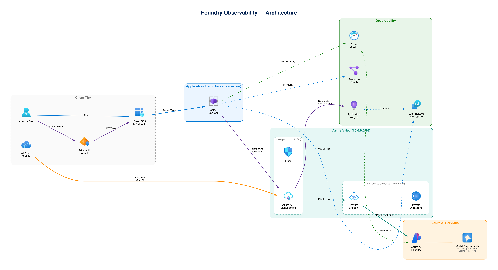

# Foundry Observability

A real-time, multi-tenant observability platform for **Azure AI Foundry** — monitors token usage, forecasts costs, manages per-user/group/deployment rate limits via APIM policy, and provides cross-subscription provisioned quota visibility.

Single binary (Docker) — serves the React SPA and FastAPI backend on one port.



---

## Table of Contents

- [Features](#features)
- [Architecture](#architecture)
- [Tech Stack](#tech-stack)
- [Prerequisites](#prerequisites)
- [Quick Start](#quick-start)
- [Environment Variables](#environment-variables)
- [Automated Setup Scripts](#automated-setup-scripts)
- [Development](#development)
- [Production Build](#production-build)
- [Docker](#docker)
- [API Reference](#api-reference)
- [Rate Limit Hierarchy](#rate-limit-hierarchy)
- [Budget → TPM Conversion](#budget--tpm-conversion)
- [APIM Policy Structure](#apim-policy-structure)
- [Usage Simulation & Throttle Testing](#usage-simulation--throttle-testing)
- [Security Model](#security-model)
- [Repository Structure](#repository-structure)
- [License](#license)

---

## Features

### Dashboard

- Real-time Azure Monitor metrics: `InputTokens`, `OutputTokens`, `TotalTokens`, `ModelRequests`
- Token trend area charts with moving averages, input/output breakdown, per-deployment bar charts
- Estimated cost per deployment using official Azure OpenAI Global Standard pricing
- Deployment summary table: model name, format, total tokens, requests, cost
- **Users & Groups** — per-user and per-group KPI cards, request charts, model usage breakdown
- Granularity: Hourly (`PT1H`), Daily (`P1D`), Weekly (`P1W`), Monthly (`P1M`)
- Date range presets: 1D, 7D, 14D, 30D
- Cross-subscription "All subscriptions / All resources" mode via Azure Resource Graph

### Settings (Rate Limit Management)

- Three-layer rate limit control: **per-user → per-group → per-deployment**
- Two limit modes per entity:
  - **TPM** — direct tokens-per-minute value
  - **Cost** — monthly dollar budget auto-converted to TPM using Azure pricing
- Live APIM policy XML viewer (VS Code-style syntax with line numbers)
- **Apply** generates full `llm-token-limit` policy with managed identity auth, metric emission, and epoch-based counter keys
- **Reset** removes all custom limits and restores the default policy
- Cost limits persisted in `cost_limits.json`

### Usage Forecast

- Monthly cost projection using observed usage (7 / 14 / 30-day lookback)
- Cross-subscription aggregation — queries all Foundry resources in parallel
- Top subscriptions, top resources, top projects by estimated cost
- Cost distribution pie chart by subscription
- Per-user and per-group forecast tables

### Provisioned Quotas

- Cross-subscription view of every provisioned TPM and RPM allocation
- Aggregation by resource, model, region, or subscription
- TPM distribution pie charts and bar charts by model/region
- Sortable, groupable, searchable deployment table
- Direct links to Azure Portal quota request form per deployment

### Authentication

- **MSAL.js** with OAuth2 PKCE — per-user Entra ID sign-in
- ARM tokens acquired silently per-request
- Azure RBAC passthrough — the user only sees resources they have access to
- No shared credentials in the frontend; no secrets in the SPA bundle

---

## Architecture

```
┌──────────────────────────────────────────────────────────────┐
│                         Client Tier                          │
│  Admin / Dev ──HTTPS──▶ React SPA (MSAL Auth)               │
│  AI Clients  ──APIM Key──────────────────────┐               │
└──────────────────┬───────────────────────────┼───────────────┘
                   │ Bearer Token              │ APIM Key
┌──────────────────▼───────────────────────────┼───────────────┐
│              Application Tier                │               │
│  FastAPI + uvicorn (Docker)                  │               │
│   ├─ /api/*  (ARM proxy)                     │               │
│   └─ /*      (SPA static files)              │               │
└──────┬──────┬──────┬──────┬──────────────────┼───────────────┘
       │      │      │      │                  │
       ▼      ▼      ▼      ▼                  ▼
    Azure   Azure   Resource  Log        Azure API
    Monitor Foundry  Graph   Analytics   Management
   (metrics)(deploy) (cross)  (KQL)     (policy, limits)
                                              │
                                              ▼
                                        Azure AI Foundry
                                       (Model Deployments)
                                    GPT · DeepSeek · Kimi · Llama · Phi
```

**Data flow:**

1. User authenticates via Entra ID → MSAL acquires ARM JWT
2. React SPA sends API requests with `Authorization: Bearer <token>` to FastAPI
3. FastAPI proxies calls to Azure Management APIs using the user's token
4. Azure Monitor returns token metrics per deployment
5. APIM policy is read/written via ARM REST API
6. Resource Graph discovers resources across all subscriptions
7. Log Analytics returns per-user/group request stats (via `emit-metric` custom dimensions)
8. AI clients send chat completions through APIM with per-user subscription keys
9. APIM enforces `llm-token-limit` policies and emits telemetry to Application Insights

---

## Tech Stack

| Layer | Technologies |
|-------|-------------|
| **Frontend** | React 18, TypeScript 5.4, Vite 5, TanStack Query, Recharts, Tailwind CSS 3, MSAL.js v3, Lucide icons |
| **Backend** | Python 3.13, FastAPI, uvicorn, httpx, python-dotenv |
| **Azure** | AI Foundry, API Management (StandardV2), Azure Monitor, Log Analytics, Application Insights, Entra ID, Resource Graph |
| **Deployment** | Docker (multi-stage: Node 22 → Python 3.12-slim), Azure Container Apps / App Service |
| **AI Clients** | OpenAI Python SDK (`openai >= 1.30`), per-user APIM subscription keys |

---

## Prerequisites

- **Node.js** 18+
- **Python** 3.11+
- **Azure CLI** (`az`) — logged in
- **Azure subscription** with:
  - At least one AI Foundry / Azure OpenAI resource with model deployments
  - Azure API Management instance (StandardV2 recommended)
  - Log Analytics workspace (for per-user/group tracking)
  - Application Insights (connected to APIM for `emit-metric`)
- **Entra ID app registration** — see [Automated Setup Scripts](#automated-setup-scripts)

---

## Quick Start

```bash
# 1. Clone
git clone https://github.com/<org>/foundry-observability.git
cd foundry-observability

# 2. Create .env from template
cp .env.example .env
# Edit .env with your Azure resource details (see Environment Variables below)

# 3. Register Entra ID app (interactive — creates app + writes CLIENT_ID to .env)
chmod +x scripts/register-entra-app.sh
./scripts/register-entra-app.sh

# 4. Wire APIM (discovers all APIM + Foundry resources, creates backends/API/policy)
chmod +x scripts/wire-apim.sh
./scripts/wire-apim.sh

# 5. Backend
python -m venv .venv
source .venv/bin/activate
pip install -r backend/requirements.txt

# 6. Frontend build → serve from backend
cd frontend && npm install && npm run build
rm -rf ../backend/static && cp -r dist ../backend/static
cd ..

# 7. Run
cd backend && uvicorn main:app --host 0.0.0.0 --port 8004 --reload
```

Open `http://localhost:8004` → Sign in with Microsoft → Select subscription → Select resource.

---

## Environment Variables

Create a `.env` file in the project root:

```env
# ── Entra ID (required for MSAL auth) ────────────────────────
AZURE_CLIENT_ID=<app-registration-client-id>
AZURE_TENANT_ID=<your-tenant-id>

# ── APIM (required for policy management) ─────────────────────
APIM_SERVICE_NAME=<your-apim-service-name>
APIM_SUBSCRIPTION_ID=<azure-subscription-id-containing-apim>
APIM_RESOURCE_GROUP=<resource-group-containing-apim>
APIM_API_ID=azure-openai
APIM_BACKEND_ID=backend-<your-foundry-resource-name>
DEFAULT_TPM=100000

# ── Log Analytics (for per-user/group tracking) ──────────────
LAW_NAME=<your-log-analytics-workspace-name>
```

**How to find these values:**

```bash
# APIM service name
az apim list --query "[].name" -o tsv

# APIM API ID
az apim api list --service-name <apim> -g <rg> --query "[].name" -o tsv

# APIM Backend ID
az rest --method GET \
  --uri "https://management.azure.com/subscriptions/<sub>/resourceGroups/<rg>/providers/Microsoft.ApiManagement/service/<apim>/backends?api-version=2022-08-01" \
  --query "value[].name" -o tsv

# Log Analytics workspace name
az monitor log-analytics workspace list --query "[].name" -o tsv
```

---

## Automated Setup Scripts

### `scripts/register-entra-app.sh`

Automates Entra ID app registration:

- Creates or reuses an app registration (`foundry-observability`)
- Configures SPA redirect URIs (`http://localhost:8004` + optional Container Apps hostname)
- Enables ID-token implicit grant for MSAL popup
- Adds delegated Azure Management API permission (`user_impersonation`)
- Creates a service principal
- Writes `AZURE_CLIENT_ID` and `AZURE_TENANT_ID` to `.env`

```bash
chmod +x scripts/register-entra-app.sh
./scripts/register-entra-app.sh
```

### `scripts/wire-apim.sh`

Auto-discovers and wires APIM to Foundry resources:

- Discovers all APIM instances and Foundry/OpenAI resources across the tenant via Resource Graph
- Enables SystemAssigned Managed Identity on APIM
- Creates an APIM backend per Foundry resource
- Creates the `azure-openai` API with chat completions operation
- Applies inbound/outbound policy (MI auth, rate limit, `emit-metric`)
- Creates the Product + dev subscription
- Creates per-user APIM subscriptions (Peter Parker, Tonny Stark, Son Goku, Monkey D. Luffy)
- Assigns `Cognitive Services OpenAI User` role on every discovered Foundry resource
- Optional: VNet + Private Endpoint + Private DNS setup

```bash
chmod +x scripts/wire-apim.sh
./scripts/wire-apim.sh
```

---

## Development

### Backend (hot reload)

```bash
python -m venv .venv
source .venv/bin/activate
pip install -r backend/requirements.txt
cd backend && uvicorn main:app --host 0.0.0.0 --port 8004 --reload
```

### Frontend (Vite dev server with proxy)

```bash
cd frontend
npm install
npm run dev
# → http://localhost:5173, proxies /api/* → http://localhost:8004
```

---

## Production Build

```bash
cd frontend && npm run build
rm -rf ../backend/static && cp -r dist ../backend/static
cd ../backend && uvicorn main:app --host 0.0.0.0 --port 8004
```

---

## Docker

```bash
# Build
docker build -t foundry-observability .

# Run
docker run -p 8004:8004 --env-file .env foundry-observability

# Or use docker-compose
docker compose up -d
```

The `Dockerfile` is a multi-stage build:
1. **Stage 1** — Node 22 Alpine builds the React frontend (`npm run build`)
2. **Stage 2** — Python 3.12 slim installs backend deps + copies built SPA into `static/`
3. Serves everything on port `8004` via uvicorn

---

## API Reference

All endpoints require an `Authorization: Bearer <ARM-token>` header (acquired by MSAL in the frontend).

| Endpoint | Method | Description |
|----------|--------|-------------|
| `/api/config` | `GET` | Runtime config: APIM names, client/tenant IDs, default TPM |
| `/api/subscriptions` | `GET` | All enabled Azure subscriptions for the caller |
| `/api/foundry-resources` | `GET` | AI Foundry / OpenAI / Cognitive Services accounts (supports `subId=__all__` for cross-subscription via Resource Graph) |
| `/api/projects` | `GET` | Projects under a Foundry resource |
| `/api/deployments` | `GET` | Model deployments for a Foundry resource (name, model, format) |
| `/api/metrics` | `GET` | Azure Monitor token usage metrics per deployment with configurable granularity and time range |
| `/api/forecast` | `GET` | Cross-subscription metrics aggregation for cost forecasting |
| `/api/quotas` | `GET` | Provisioned TPM/RPM for every deployment across all subscriptions |
| `/api/policy` | `GET` | Current APIM policy XML + parsed per-user/group/deployment limits |
| `/api/policy` | `PUT` | Build and apply a new APIM policy from rate limit configuration |
| `/api/policy` | `DELETE` | Reset policy to defaults (removes all custom limits) |
| `/api/users-groups` | `GET` | Log Analytics KQL query for per-user/group request stats from `emit-metric` |
| `/api/cost-limits` | `GET` | Cost limit configuration (users, groups, deployments) |
| `/api/cost-limits` | `PUT` | Update cost limits |
| `/api/pricing` | `GET` | Scraped Azure pricing for all supported models |

Interactive API docs: `http://localhost:8004/api/docs` (Swagger UI)

---

## Rate Limit Hierarchy

When a request arrives at APIM, `llm-token-limit` policies are evaluated in this order — **first match wins**:

```
1. Per-User      →  Individual APIM subscription TPM (e.g., tonny-stark = 5,000 TPM)
2. Per-Group     →  Shared TPM across group members (e.g., superheroes = 15,000 TPM)
3. Per-Deployment →  Model-specific limit (e.g., gpt-5.4-mini = 50,000 TPM)
4. Global Default →  Catch-all fallback (configured via DEFAULT_TPM)
```

Each `llm-token-limit` block uses an **epoch-based counter key** that resets whenever you click **Apply** in the Settings page. This prevents stale counters from previous rate-limit configurations from causing unexpected 429s.

---

## Budget → TPM Conversion

When you set a limit in **cost mode** (monthly dollar budget), the system converts it to TPM:

```
blended_per_1K  = (input_price × 0.75 + output_price × 0.25) / 1,000
monthly_tokens  = budget / blended_per_1K × 1,000
TPM             = floor(monthly_tokens / 43,200)
```

Where `43,200 = 30 days × 24 hours × 60 minutes`.

Pricing is sourced from official Azure pages:
- [Azure OpenAI](https://azure.microsoft.com/en-us/pricing/details/cognitive-services/openai-service/)
- [DeepSeek](https://azure.microsoft.com/en-us/pricing/details/ai-foundry-models/deepseek/)
- [Kimi](https://azure.microsoft.com/en-us/pricing/details/ai-foundry-models/kimi/)
- [Llama](https://azure.microsoft.com/en-us/pricing/details/ai-foundry-models/llama/)
- [Microsoft / Phi](https://azure.microsoft.com/en-us/pricing/details/ai-foundry-models/microsoft/)

---

## APIM Policy Structure

The generated policy XML includes:

```xml
<policies>
  <inbound>
    <set-backend-service backend-id="backend-<foundry-resource>" />
    <authentication-managed-identity resource="https://cognitiveservices.azure.com" />
    <set-header name="Authorization">Bearer <MI-token></set-header>
    <set-header name="api-key" exists-action="delete" />

    <!-- Per-user limits (one block per user) -->
    <llm-token-limit tokens-per-minute="5000"
                     counter-key="user/tonny-stark/<epoch>"
                     estimate-prompt-tokens="true"
                     remaining-tokens-header-name="x-token-remaining">
      <limit-by condition="@(context.Subscription.Id == &quot;tonny-stark&quot;)" />
    </llm-token-limit>

    <!-- Per-group limits -->
    <llm-token-limit tokens-per-minute="15000"
                     counter-key="group/superheroes/<epoch>" ...>
      <limit-by condition="@(... member check ...)" />
    </llm-token-limit>

    <!-- Per-deployment limits -->
    <llm-token-limit tokens-per-minute="50000"
                     counter-key="dep/gpt-5.4-mini/<epoch>" ...>
      <limit-by condition="@(... deployment check ...)" />
    </llm-token-limit>

    <!-- Global default -->
    <llm-token-limit tokens-per-minute="100000"
                     counter-key="default/<epoch>" ... />
  </inbound>

  <outbound>
    <emit-metric name="APIM Requests" namespace="ClawPilot">
      <dimension name="Subscription ID" />
      <dimension name="Model Deployment" />
      <dimension name="Status" value="success" />
    </emit-metric>
  </outbound>

  <on-error>
    <emit-metric ... value="blocked" />
  </on-error>
</policies>
```

Key design decisions:
- **Managed Identity** auth to Foundry backend — no API keys forwarded
- **`emit-metric`** with `Subscription ID` + `Model Deployment` dimensions — enables per-user analytics in Application Insights
- **Epoch counter keys** — each Apply creates fresh rate-limit buckets, preventing stale 429s from prior configurations

---

## Usage Simulation & Throttle Testing

The `usage-simulation/` directory contains scripts that send real chat completions through APIM to test rate limiting and generate dashboard metrics.

### Prerequisites

```bash
# Install simulation deps
cd usage-simulation
pip install -r requirements.txt

# Configure .env with APIM gateway URL + per-user subscription keys
cp .env.example .env
# Edit .env — set APIM_GATEWAY_URL and all 4 user keys
```

Retrieve APIM subscription keys:

```bash
# Replace <sub>, <rg>, <apim>, <user-id> with your values
az rest --method POST \
  --uri "https://management.azure.com/subscriptions/<sub>/resourceGroups/<rg>/providers/Microsoft.ApiManagement/service/<apim>/subscriptions/<user-id>/listSecrets?api-version=2022-08-01" \
  --query primaryKey -o tsv
```

### Single-User Simulation

Send prompts as a specific user and observe rate-limit behavior. Output is saved to a markdown file with full responses, token counts, and cost estimates.

```bash
# Basic — send 1 prompt as Tonny Stark via gpt-5.4-mini
.venv/bin/python single-simulation/simulate_user.py --user tonny-stark --deployment gpt-5.4-mini

# Multiple rounds
.venv/bin/python single-simulation/simulate_user.py --user peter-parker --rounds 5

# Different model deployments
.venv/bin/python single-simulation/simulate_user.py --user son-goku --deployment DeepSeek-V3.2
.venv/bin/python single-simulation/simulate_user.py --user son-goku --deployment Llama-4-Maverick-17B-128E-Instruct-FP8
.venv/bin/python single-simulation/simulate_user.py --user peter-parker --deployment gpt-5.3-codex

# Custom prompt with fast pacing
.venv/bin/python single-simulation/simulate_user.py --user monkey-d-luffy --prompt "Explain Kubernetes" --delay 0.5 --rounds 3
```

Available users: `peter-parker`, `tonny-stark`, `son-goku`, `monkey-d-luffy`

### Burst Simulation — Trigger 429 Throttling

Sends rapid-fire requests to intentionally exceed TPM limits and provoke APIM 429 responses:

```bash
# Default: 15 rapid calls with no delay
.venv/bin/python single-simulation/burst_simulate.py --user peter-parker

# Heavy burst with large completions
.venv/bin/python single-simulation/burst_simulate.py --user tonny-stark --rounds 20 --max-tokens 4096

# Burst against a specific model
.venv/bin/python single-simulation/burst_simulate.py --user son-goku --deployment DeepSeek-V3.2
```

Expected output:

```
[1/15] Write a detailed 2000-word essay about the history of AI…
  ✓ 42 in / 4096 out · $0.018474
[2/15] Explain quantum computing in extreme detail…
  ✓ 38 in / 4096 out · $0.018474
[3/15] Write a comprehensive guide to microservices…
  ⚠ THROTTLED (429) — rate limit hit!
```

### Budget-Based Simulation

Drive usage up to a target dollar budget per user:

```bash
# $1/user budget, both models, all 4 users in parallel
.venv/bin/python simulate_to_budget.py

# $5/user, GPT only
.venv/bin/python simulate_to_budget.py --budget 5.0 --models gpt

# Dry run — estimate calls needed without making API calls
.venv/bin/python simulate_to_budget.py --budget 10.0 --dry-run
```

### Per-User Scripts

Run individual user simulations:

```bash
.venv/bin/python peter_parker.py                         # default deployment
.venv/bin/python tonny_stark.py --deployment Kimi-K2.5    # Kimi model
.venv/bin/python son_goku.py --rounds 3                   # 3× prompts
.venv/bin/python monkey_d_luffy.py
```

### All Users Concurrently

```bash
# All 4 users in parallel via threading
.venv/bin/python run_all.py

# 3 rounds per user against Kimi
.venv/bin/python run_all.py --deployment Kimi-K2.5 --rounds 3
```

### Verify Results

After running simulations:

1. Open `http://localhost:8004` → **Dashboard**
2. Select the subscription and Foundry resource
3. Set date range to **1D** and granularity to **Hourly**
4. Token usage, cost, and per-user/group stats should reflect the simulation traffic
5. In **Settings**, observe rate limit counters and policy XML

---

## Security Model

| Concern | Implementation |
|---------|---------------|
| **Authentication** | MSAL.js v3 with OAuth2 PKCE — per-user Entra ID sign-in, no shared credentials |
| **Authorization** | ARM tokens pass through to Azure APIs — Azure RBAC enforces permissions, no privilege escalation |
| **Backend auth to Foundry** | APIM Managed Identity + `authentication-managed-identity` policy — no API keys forwarded |
| **Per-user isolation** | Each user gets a unique APIM subscription key; `emit-metric` tracks per-key usage |
| **Network isolation** | Optional VNet integration: APIM in `snet-apim`, Foundry behind Private Endpoints in `snet-private-endpoints`, Private DNS zone |
| **Secrets management** | All secrets in `.env` (gitignored); no secrets in frontend bundle; keys read from env vars at runtime |
| **API key stripping** | APIM policy deletes `api-key` header before forwarding — clients cannot bypass MI auth |
| **NSG rules** | Allows APIM management (3443), Azure LB (6390), HTTPS (443), Storage/SQL/AAD outbound |

---

## Repository Structure

```
foundry-observability/
├── .env.example                  # Template for environment variables
├── .gitignore                    # Excludes .env, node_modules, __pycache__, static/
├── Dockerfile                    # Multi-stage: Node 22 → Python 3.12-slim
├── docker-compose.yml            # Single service, port 8004
│
├── backend/
│   ├── main.py                   # FastAPI entrypoint — mounts routers + serves SPA
│   ├── requirements.txt          # fastapi, uvicorn, httpx, python-dotenv
│   ├── cost_limits.json          # Persisted cost/TPM limits
│   └── routers/
│       ├── config.py             # GET /api/config — runtime configuration
│       ├── subscriptions.py      # GET /api/subscriptions, /api/foundry-resources
│       ├── deployments.py        # GET /api/deployments — model deployments
│       ├── metrics.py            # GET /api/metrics — Azure Monitor token metrics
│       ├── policy.py             # GET/PUT/DELETE /api/policy — APIM policy CRUD
│       ├── cost_limits.py        # GET/PUT /api/cost-limits
│       ├── quotas.py             # GET /api/quotas — cross-subscription TPM/RPM
│       └── pricing.py            # GET /api/pricing — scraped Azure model pricing
│
├── frontend/
│   ├── package.json              # React 18, MSAL, TanStack Query, Recharts, Tailwind
│   ├── vite.config.ts            # Dev server proxies /api → localhost:8004
│   └── src/
│       ├── App.tsx               # Router: Dashboard, Settings, Forecast, Quotas, About
│       ├── main.tsx              # React root
│       ├── types.ts              # TypeScript interfaces
│       ├── pricing.ts            # Model pricing table (Azure Global Standard)
│       ├── api/
│       │   └── client.ts         # useApiClient() hook — MSAL token + fetch wrapper
│       ├── auth/
│       │   └── msalConfig.ts     # MSAL configuration (reads from /api/config)
│       ├── components/
│       │   ├── Dashboard.tsx     # Token metrics, charts, cost, users/groups
│       │   ├── Settings.tsx      # Rate limit management, policy XML viewer
│       │   ├── UsageForecast.tsx # Cost projections (7/14/30-day lookback)
│       │   ├── Quotas.tsx        # Cross-subscription provisioned TPM/RPM
│       │   ├── About.tsx         # Feature showcase + field reference
│       │   ├── Layout.tsx        # App shell (TopBar + ContextBar + Outlet)
│       │   ├── TopBar.tsx        # Navigation, dark/light mode, user avatar
│       │   ├── ContextBar.tsx    # Subscription/resource/project selectors
│       │   └── LoginPage.tsx     # Pre-auth "Sign in with Microsoft"
│       └── context/
│           └── AppContext.tsx     # Global state (config, theme, selected resources)
│
├── scripts/
│   ├── register-entra-app.sh     # Entra ID app registration automation
│   └── wire-apim.sh              # APIM discovery + wiring automation
│
├── usage-simulation/
│   ├── .env.example              # Template: APIM gateway URL + per-user keys
│   ├── requirements.txt          # openai, python-dotenv
│   ├── common.py                 # Shared AzureOpenAI client builder + helpers
│   ├── peter_parker.py           # User sim — superheroes group
│   ├── tonny_stark.py            # User sim — superheroes group
│   ├── son_goku.py               # User sim — manga group
│   ├── monkey_d_luffy.py         # User sim — manga group
│   ├── run_all.py                # Parallel runner for all 4 users
│   ├── simulate_to_budget.py     # Budget-based simulation ($N per user)
│   ├── simulate_user.py          # Single-user simulation (top-level)
│   └── single-simulation/
│       ├── simulate_user.py      # Single-user sim with markdown output
│       └── burst_simulate.py     # Rapid-fire burst to trigger 429s
│
├── clients/
│   ├── call_apim.py              # Direct APIM call example
│   ├── call_gpt5mini.py          # Direct Azure OpenAI call
│   ├── call_kimi.py              # Direct Kimi model call
│   └── requirements.txt
│
├── tests/
│   └── test_apim.http            # REST Client test suite (7 tests)
│
├── assets/
│   ├── architecture.png          # Architecture diagram
│   ├── architecture.drawio       # Editable diagram source
│   ├── architecture.excalidraw   # Excalidraw version
│   └── solution-overview.md      # Detailed solution design document
│
└── docs/
    ├── ReadME.md                 # Original docs (superseded by this file)
    ├── entra-app-registration.md # Entra ID app registration guide
    └── usage-simulation.md       # Usage simulation guide
```

---

## License

© Ben Dali. All rights reserved.
